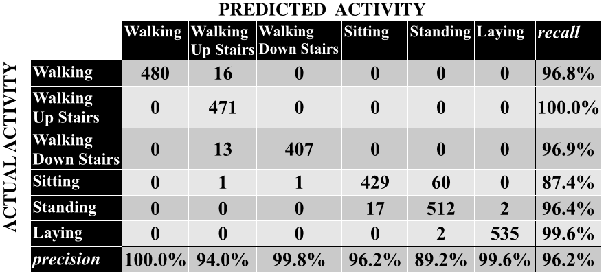

# Identifying Human Activity from Smartphone Sensor Data with a Recurrent Neural Network (RNN)
A simple recurrent neural network was trained on a Samsung Galaxy SII's accelerometer and gyroscope data to identify various human activities. The data set, which is a UCI data set, has approximately 10,300 rows, 561 columns, and considers six human activities: walking, walking up stairs, walking down stairs, standing, sitting, and walking. 

Because of the high dimensionality the data set, linear discriminant analysis was used to compress the data from 561 columns to 5 columns. Although some nuance was undoubtedly lost by compressing the data, the benefits compensated for that loss. The model was much more accurate and took a fraction of the time to train on the 5 column set as opposed to the 561 column set.

A recurrent neural network was chosen for its capacity for, crudely speaking, short-term memory. This is especially useful in sequential data, such as this data set, where what happened a second or two ago can help one know what is happening and/or what is going to happen. The results are presented in the confusion matrix below. Overall, the RNN was 96.2% accurate.

Dataset Source:
Davide Anguita, Alessandro Ghio, Luca Oneto, Xavier Parra and Jorge L. Reyes-Ortiz. A Public Domain Dataset for Human Activity Recognition Using Smartphones. 21th European Symposium on Artificial Neural Networks, Computational Intelligence and Machine Learning, ESANN 2013. Bruges, Belgium 24-26 April 2013.

https://archive.ics.uci.edu/ml/datasets/Human+Activity+Recognition+Using+Smartphones
